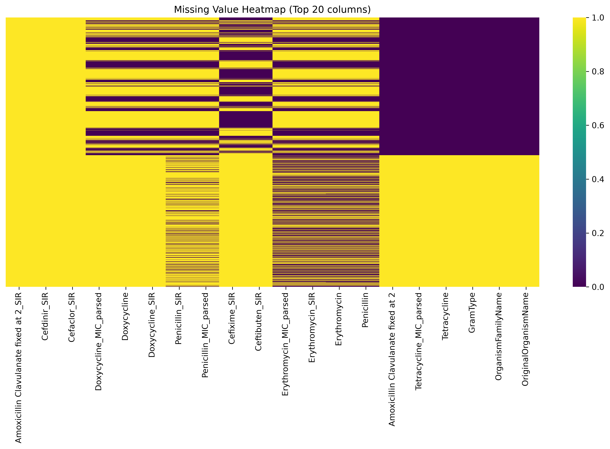
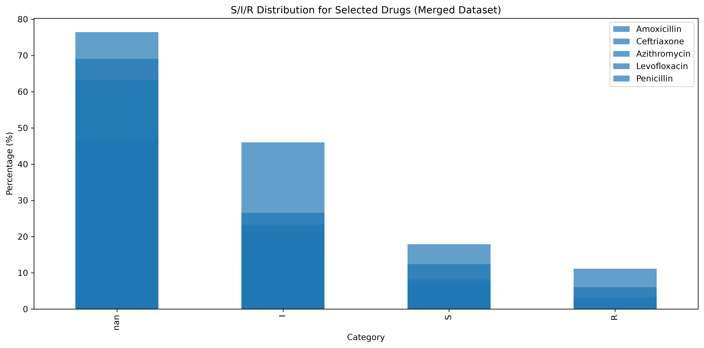
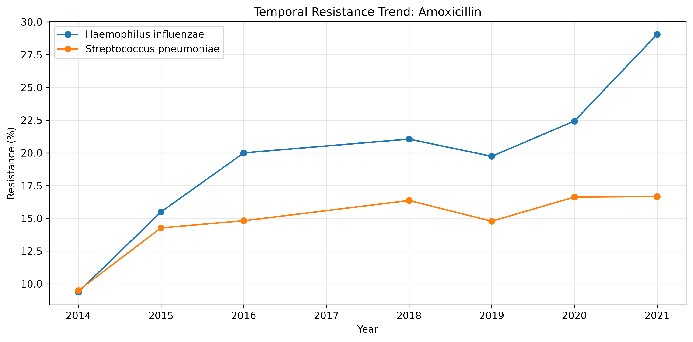
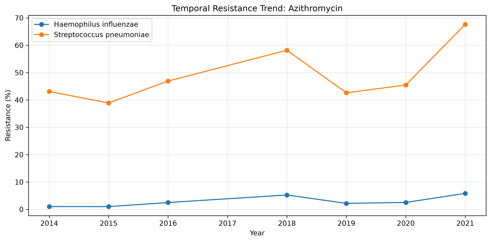
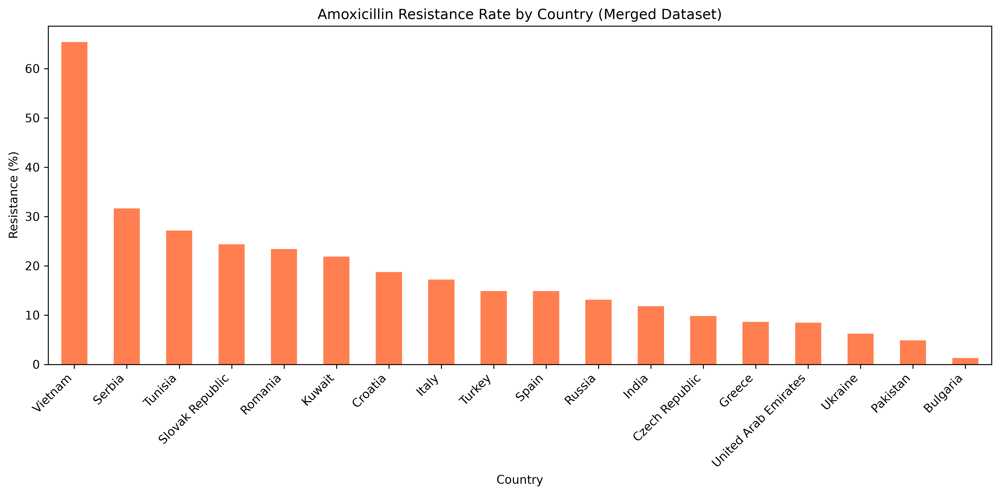

# Exploratory Data Analysis – Merged Enriched Dataset

*Generated on 2026-07-14 14:05*

## 1. Dataset Overview

| Metric | Value |
|--------|-------|
| Rows | 4934 |
| Columns | 79 |
| Species | 2 |
| Countries | 18 |
| Years | 2014 – 2021 |
| Regions | 4 |

## 2. Missingness

Columns with >10% missing:

| Column | Missing % |
|--------|-----------|
| Amoxicillin Clavulanate fixed at 2_SIR | 100.0% |
| Cefdinir_SIR | 100.0% |
| Cefaclor_SIR | 100.0% |
| Doxycycline_MIC_parsed | 79.9% |
| Doxycycline | 79.9% |
| Doxycycline_SIR | 79.9% |
| Penicillin_SIR | 69.1% |
| Penicillin_MIC_parsed | 69.1% |
| Cefixime_SIR | 69.0% |
| Ceftibuten_SIR | 69.0% |
| Erythromycin_MIC_parsed | 52.6% |
| Erythromycin_SIR | 52.6% |
| Erythromycin | 52.6% |
| Penicillin | 52.6% |
| Amoxicillin Clavulanate fixed at 2 | 48.9% |
| Tetracycline_MIC_parsed | 48.9% |
| Tetracycline | 48.9% |
| GramType | 48.9% |
| OrganismFamilyName | 48.9% |
| OriginalOrganismName | 48.9% |
| Tetracycline_SIR | 48.9% |
| Investigator | 48.9% |
| InvestigatorName | 48.9% |
| Cefotaxime_SIR | 48.9% |
| Cefotaxime_MIC_parsed | 48.9% |
| Cefpodoxime | 48.9% |
| Ceftibuten_MIC_parsed | 48.9% |
| Amoxicillin Clavulanate fixed at 2_MIC_parsed | 48.9% |
| Cefixime | 48.9% |
| Cefixime_MIC_parsed | 48.9% |
| Cefdinir | 48.9% |
| Cefpodoxime_SIR | 48.9% |
| FacilityName | 48.9% |
| Evaluable | 48.9% |
| Cefotaxime | 48.9% |
| Cefpodoxime_MIC_parsed | 48.9% |
| Ceftibuten | 48.9% |
| Cefdinir_MIC_parsed | 48.9% |
| Beta Lactamase | 47.4% |
| Ampicillin_SIR | 37.1% |
| Ampicillin_MIC_parsed | 37.1% |
| Amoxicillin_MIC_parsed | 26.6% |
| Amoxicillin_SIR | 26.6% |
| Ceftriaxone_MIC_parsed | 21.3% |
| Ceftriaxone_SIR | 21.3% |
| Ampicillin | 20.1% |
| Cefuroxime_MIC_parsed | 16.9% |
| Cefuroxime_SIR | 16.9% |
| Amoxicillin Clavulanate_SIR | 16.4% |
| Amoxicillin Clavulanate_MIC_parsed | 16.4% |
| Clarithromycin_MIC_parsed | 13.6% |
| Clarithromycin_SIR | 13.6% |

## 3. Baseline Characteristics

|                          |    N | Median Age (IQR)   |   Male (%) |   Female (%) |   Countries | Year Range   |   Respiratory (%) |   Blood (%) |
|:-------------------------|-----:|:-------------------|-----------:|-------------:|------------:|:-------------|------------------:|------------:|
| Haemophilus influenzae   | 2595 | 40 (9–63)          |       57   |         42.5 |          18 | 2014–2021    |              91.2 |         2.8 |
| Streptococcus pneumoniae | 2339 | 27 (4–58)          |       59.5 |         40.2 |          18 | 2014–2021    |              76.2 |        13   |

## 4. Species and Geographic Distributions

### Species

| FinalOrganismName        |   count |
|:-------------------------|--------:|
| Haemophilus influenzae   |    2595 |
| Streptococcus pneumoniae |    2339 |

### Top Countries

| Country        |   count |
|:---------------|--------:|
| Russia         |     558 |
| Turkey         |     457 |
| Spain          |     451 |
| Czech Republic |     397 |
| Romania        |     372 |
| India          |     348 |
| Ukraine        |     336 |
| Vietnam        |     335 |
| Italy          |     326 |
| Bulgaria       |     237 |

### Regions

| Region      |   count |
|:------------|--------:|
| Europe      |    3787 |
| Asia        |     807 |
| Middle East |     211 |
| Africa      |     129 |

### Years

|   YearCollected |   count |
|----------------:|--------:|
|            2014 |     212 |
|            2015 |    2040 |
|            2016 |     161 |
|            2018 |      93 |
|            2019 |     343 |
|            2020 |    1158 |
|            2021 |     927 |

## 5. Resistance Distributions

Full summary available in `sir_distribution_merged.csv`.

## 6. Temporal Trends

## 7. Geographic Resistance

## 8. Class Imbalance Summary

|    | Drug                               | Species                  |    S |    I |    R | Recommendation   |
|---:|:-----------------------------------|:-------------------------|-----:|-----:|-----:|:-----------------|
|  0 | Amoxicillin Clavulanate fixed at 2 | Haemophilus influenzae   |    0 |    0 |    0 | Multiclass       |
|  1 | Amoxicillin Clavulanate fixed at 2 | Streptococcus pneumoniae |    0 |    0 |    0 | Multiclass       |
|  2 | Amoxicillin Clavulanate            | Haemophilus influenzae   | 2336 |  201 |   58 | Multiclass       |
|  3 | Amoxicillin Clavulanate            | Streptococcus pneumoniae |  841 |  363 |  328 | Multiclass       |
|  4 | Amoxicillin                        | Haemophilus influenzae   |  986 |  172 |  533 | Multiclass       |
|  5 | Amoxicillin                        | Streptococcus pneumoniae | 1206 |  377 |  350 | Multiclass       |
|  6 | Ampicillin                         | Haemophilus influenzae   | 2046 |   72 |  462 | Binary           |
|  7 | Ampicillin                         | Streptococcus pneumoniae |  148 |  377 |    0 | Multiclass       |
|  8 | Azithromycin                       | Haemophilus influenzae   | 2525 |    0 |   68 | Binary           |
|  9 | Azithromycin                       | Streptococcus pneumoniae | 1247 |    0 | 1082 | Binary           |
| 10 | Cefaclor                           | Haemophilus influenzae   |    0 |    0 |    0 | Multiclass       |
| 11 | Cefaclor                           | Streptococcus pneumoniae |    0 |    0 |    0 | Multiclass       |
| 12 | Cefdinir                           | Haemophilus influenzae   |    0 |    0 |    0 | Multiclass       |
| 13 | Cefdinir                           | Streptococcus pneumoniae |    0 |    0 |    0 | Multiclass       |
| 14 | Cefixime                           | Haemophilus influenzae   | 1274 |    0 |  254 | Multiclass       |
| 15 | Cefixime                           | Streptococcus pneumoniae |    0 |    0 |    0 | Multiclass       |
| 16 | Cefotaxime                         | Haemophilus influenzae   | 1350 |    0 |  178 | Multiclass       |
| 17 | Cefotaxime                         | Streptococcus pneumoniae |  694 |  277 |   22 | Binary           |
| 18 | Cefpodoxime                        | Haemophilus influenzae   | 1260 |    0 |  268 | Multiclass       |
| 19 | Cefpodoxime                        | Streptococcus pneumoniae |  564 |    0 |  429 | Multiclass       |
| 20 | Ceftibuten                         | Haemophilus influenzae   | 1286 |    0 |  242 | Multiclass       |
| 21 | Ceftibuten                         | Streptococcus pneumoniae |    0 |    0 |    0 | Multiclass       |
| 22 | Ceftriaxone                        | Haemophilus influenzae   | 1443 |    0 |  113 | Multiclass       |
| 23 | Ceftriaxone                        | Streptococcus pneumoniae | 1673 |  611 |   45 | Binary           |
| 24 | Cefuroxime                         | Haemophilus influenzae   | 1886 |  440 |  269 | Multiclass       |
| 25 | Cefuroxime                         | Streptococcus pneumoniae |  726 |   59 |  719 | Multiclass       |
| 26 | Clarithromycin                     | Haemophilus influenzae   | 2589 |    0 |    0 | Binary           |
| 27 | Clarithromycin                     | Streptococcus pneumoniae |  609 |    0 | 1067 | Multiclass       |
| 28 | Doxycycline                        | Haemophilus influenzae   |    0 |    0 |    0 | Multiclass       |
| 29 | Doxycycline                        | Streptococcus pneumoniae |  532 |    0 |  461 | Multiclass       |
| 30 | Erythromycin                       | Haemophilus influenzae   |    0 |    0 |    0 | Multiclass       |
| 31 | Erythromycin                       | Streptococcus pneumoniae | 1259 |    0 | 1078 | Binary           |
| 32 | Levofloxacin                       | Haemophilus influenzae   | 2271 |    0 |  322 | Binary           |
| 33 | Levofloxacin                       | Streptococcus pneumoniae |    0 | 2312 |   26 | Binary           |
| 34 | Moxifloxacin                       | Haemophilus influenzae   | 2303 |    0 |  290 | Binary           |
| 35 | Moxifloxacin                       | Streptococcus pneumoniae | 2318 |    0 |   20 | Binary           |
| 36 | Penicillin                         | Haemophilus influenzae   |    0 |    0 |    0 | Multiclass       |
| 37 | Penicillin                         | Streptococcus pneumoniae |  403 |  826 |  298 | Multiclass       |
| 38 | Tetracycline                       | Haemophilus influenzae   | 1470 |    0 |   58 | Multiclass       |
| 39 | Tetracycline                       | Streptococcus pneumoniae |  503 |    0 |  490 | Multiclass       |
| 40 | Trimethoprim Sulfa                 | Haemophilus influenzae   | 1458 |    0 | 1064 | Multiclass       |
| 41 | Trimethoprim Sulfa                 | Streptococcus pneumoniae | 1393 |    0 |  939 | Binary           |

## 9. Modeling Recommendations

- Drugs with each class ≥50 samples can use **multiclass** classification.
- Drugs with a class <50 samples should use **binary** (Susceptible vs Non‑Susceptible).
- Temporal validation (train on older years, test on 2021) is recommended.
- Geographic cross‑validation (GroupKFold by Country) should be used to prevent geographic leakage.
- Consider external validation using separate data sources (SOAR vs GSK) to assess generalizability.
