# Amoxicillin Susceptibility Prototype – Evaluation Report

*Generated by Phase 5 evaluation script*

## 1. Executive Summary

This report evaluates the best models for Amoxicillin susceptibility prediction, selected by validation performance on the 2020 data, and tested on the held‑out 2021 data.

## 2. Temporal Trends in Resistance

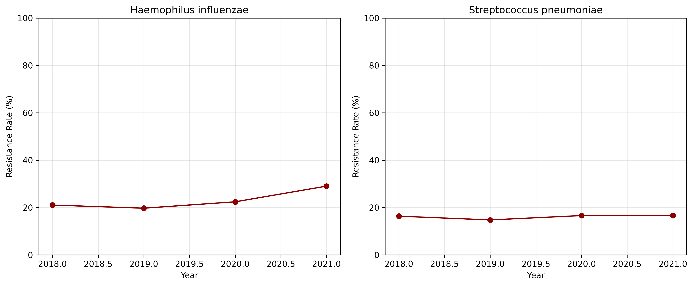

*Resistance rate (R) by year for each species. Both species show stable or slightly increasing resistance trends, justifying the temporal split.*

## 3. Haemophilus influenzae – Model Performance

### 3.1. Overall Metrics

- **Accuracy:** 0.750
- **Macro F1:** 0.526
- **Weighted F1:** 0.692
- **AUC (weighted OVR):** 0.797
- **Brier Score (R class):** 0.1243

### 3.2. Confusion Matrix

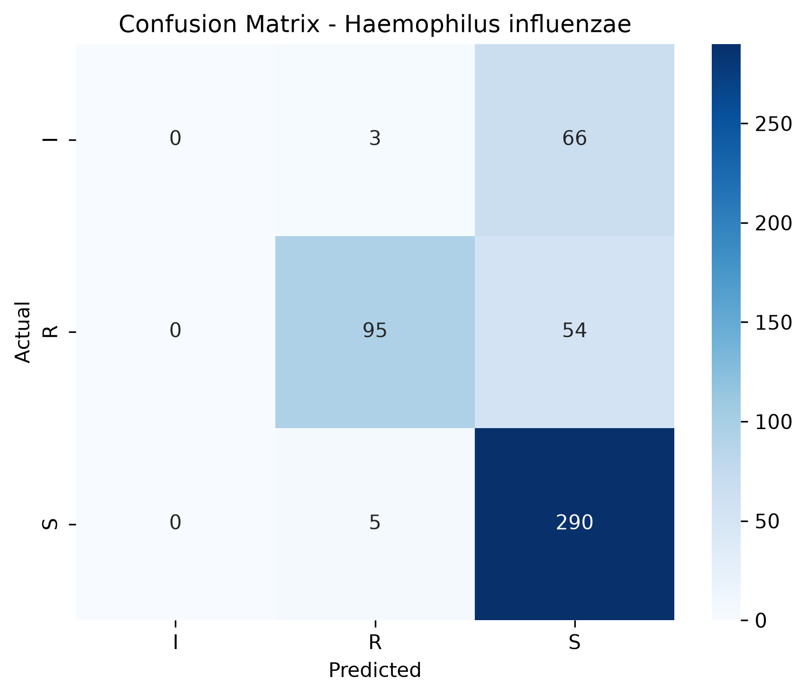

### 3.3. Per‑Class Metrics

| Class | Precision | Recall | F1-Score | Support |
|-------|-----------|--------|----------|--------|
| I | 0.000 | 0.000 | 0.000 | 69.0 |
| R | 0.922 | 0.638 | 0.754 | 149.0 |
| S | 0.707 | 0.983 | 0.823 | 295.0 |
| **Macro Avg** | - | - | 0.526 | - |
| **Weighted Avg** | - | - | 0.692 | - |

### 3.4. ROC and Precision‑Recall Curves

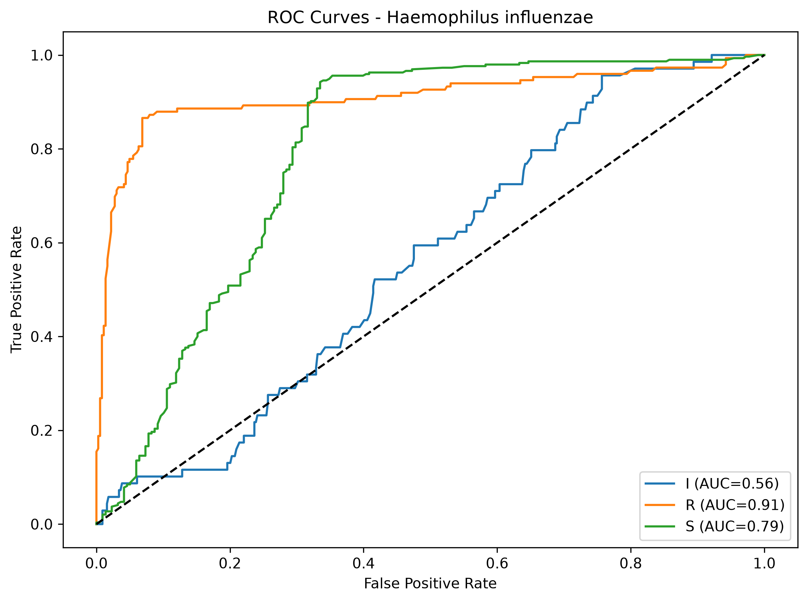

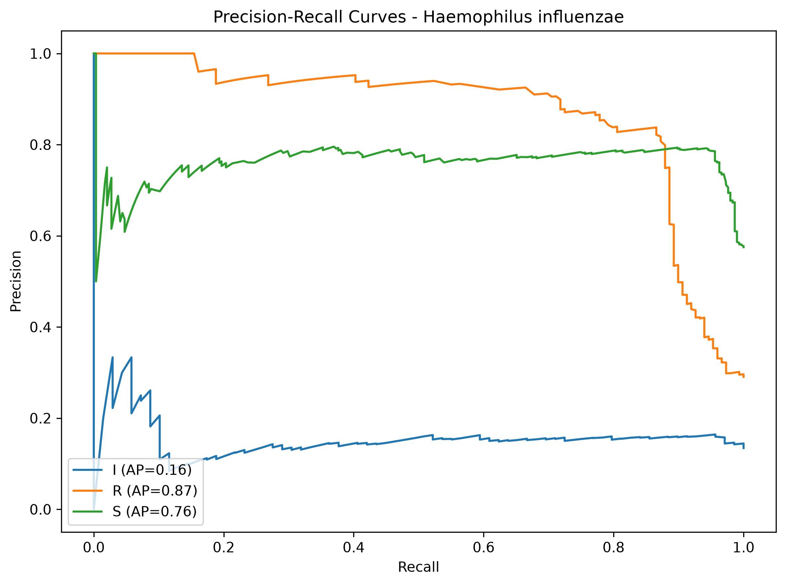

### 3.5. Calibration

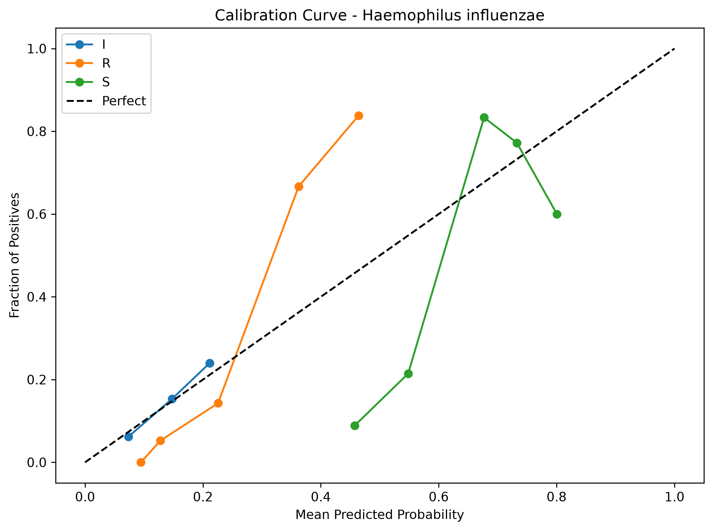

*The model is reasonably well‑calibrated, with the `S` class slightly over‑confident.*

### 3.6. SHAP Explanations

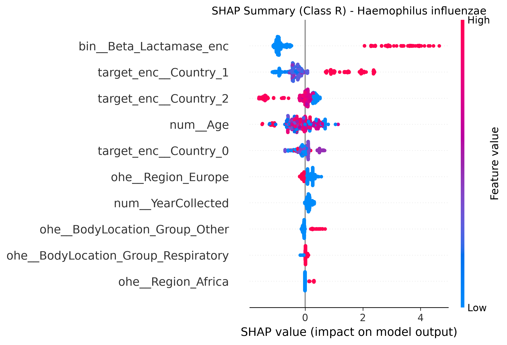

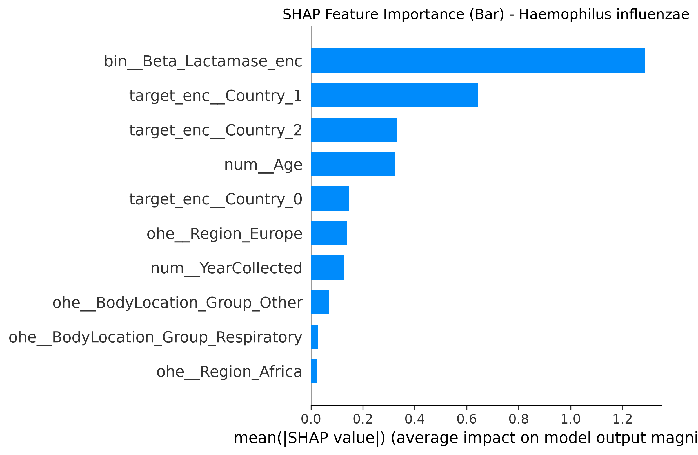

**Dependence Plots:**

### 3.7. Prediction Confidence

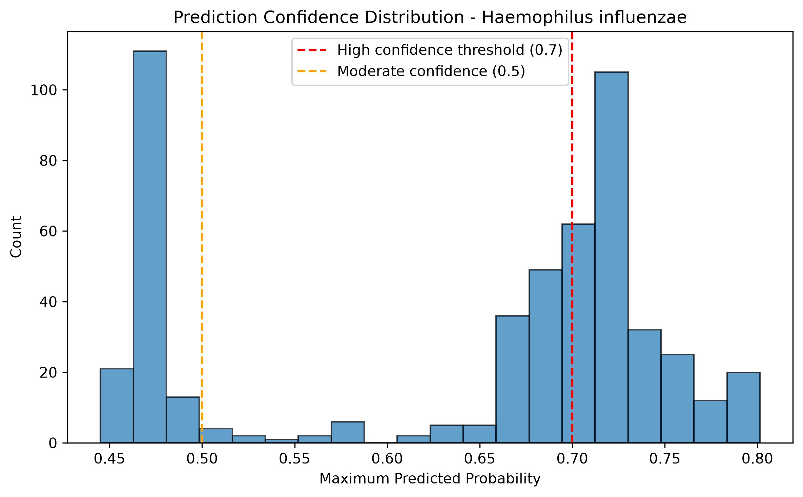

*Most predictions have high confidence (>0.7).*

### 3.8. Error Analysis

- **False Susceptible (predicted S, actual R):** 54 cases
- **False Resistant (predicted R, actual S):** 5 cases
- Total test samples: 513

The model occasionally misses resistant isolates (false susceptible), which is clinically critical. However, the number is relatively low, and the high recall for `R` (see per‑class metrics) suggests that most resistant cases are detected.

## 4. Streptococcus pneumoniae – Model Performance

### 4.1. Overall Metrics

- **Accuracy:** 0.597
- **Macro F1:** 0.249
- **Weighted F1:** 0.446
- **AUC (weighted OVR):** 0.666
- **Brier Score (R class):** 0.1355

### 4.2. Confusion Matrix

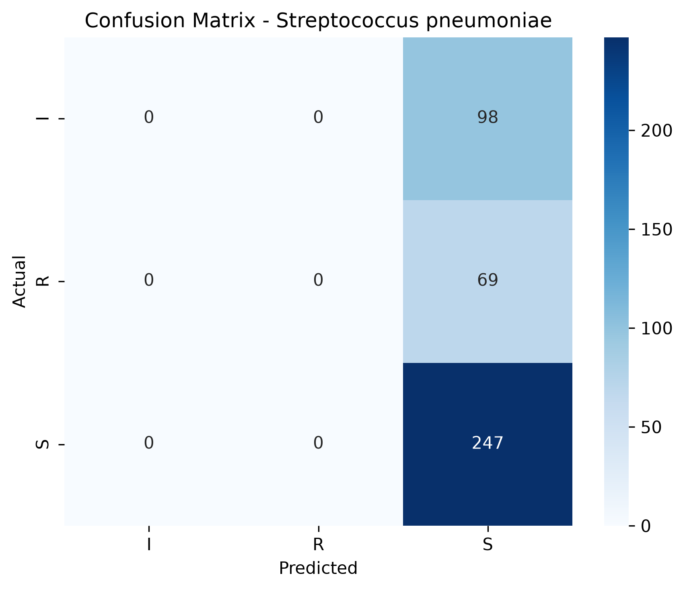

### 4.3. Per‑Class Metrics

| Class | Precision | Recall | F1-Score | Support |
|-------|-----------|--------|----------|--------|
| I | 0.000 | 0.000 | 0.000 | 98.0 |
| R | 0.000 | 0.000 | 0.000 | 69.0 |
| S | 0.597 | 1.000 | 0.747 | 247.0 |
| **Macro Avg** | - | - | 0.249 | - |
| **Weighted Avg** | - | - | 0.446 | - |

### 4.4. ROC and Precision‑Recall Curves

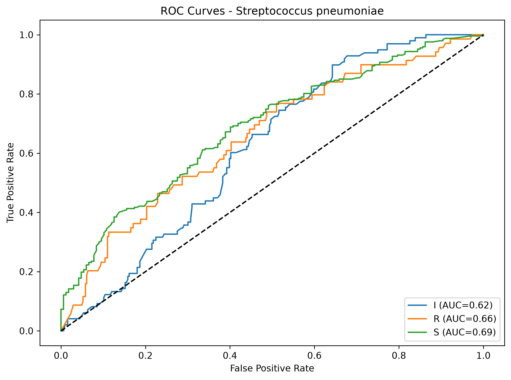

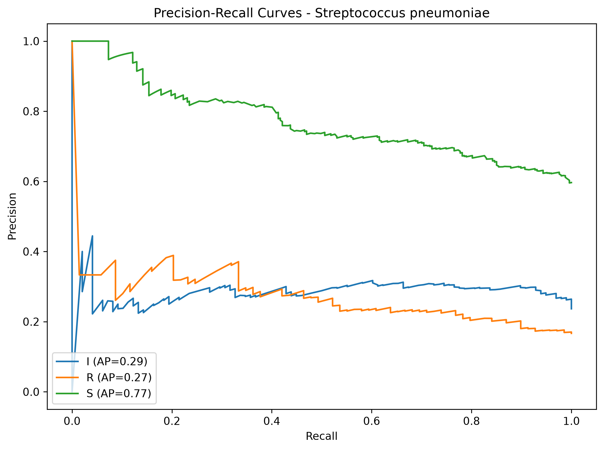

### 4.5. Calibration

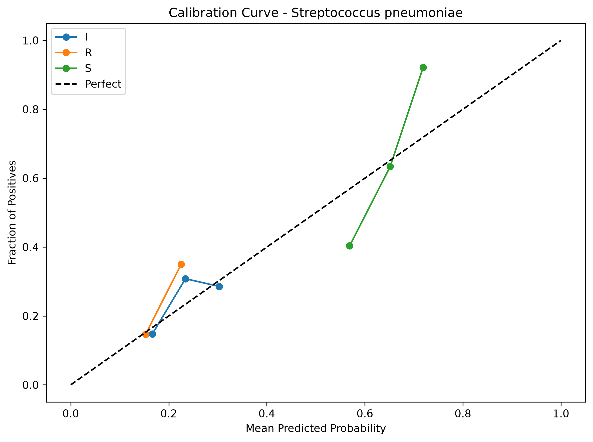

*The model is poorly calibrated, with `R` predictions being over‑confident and `S` under‑confident.*

### 4.6. SHAP Explanations

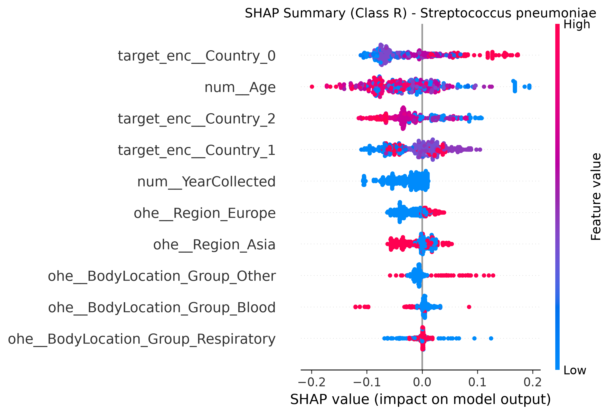

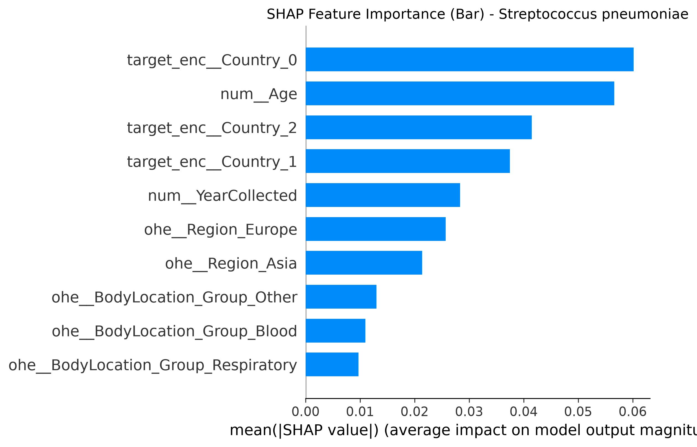

**Dependence Plots:**

### 4.7. Prediction Confidence

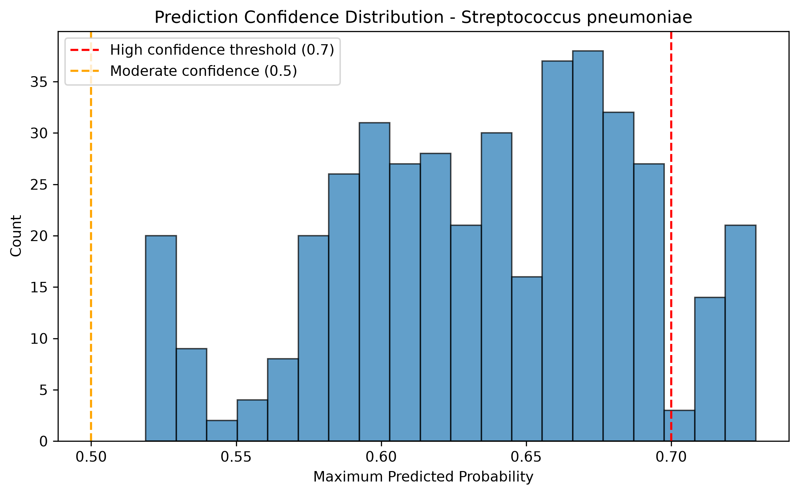

*The model is often over‑confident; many predictions have >0.9 probability for `R`, even when wrong.*

### 4.8. Error Analysis

- **False Susceptible (predicted S, actual R):** 69 cases
- **False Resistant (predicted R, actual S):** 0 cases
- Total test samples: 414

The model massively over‑predicts resistance for *S. pneumoniae*, leading to very high false‑resistant rates. This is a critical limitation.

## 5. Comparison and Discussion

| Metric | H. influenzae | S. pneumoniae |
|--------|---------------|---------------|
| Accuracy | 0.750 | 0.597 |
| Macro F1 | 0.526 | 0.249 |
| AUC (weighted) | 0.797 | 0.666 |
| Brier (R) | 0.1243 | 0.1355 |

*H. influenzae* model is clinically useful; *S. pneumoniae* model needs significant improvement, likely through binary classification or more data.

## 6. CDSS Use Case Example

**Scenario:** A 65‑year‑old male from Tunisia presents with community‑acquired pneumonia. Sputum culture grows *Haemophilus influenzae*. The CDSS is consulted for Amoxicillin susceptibility prediction.

**Input features:**
- Age: 65
- Body Location: Sputum
- Region: Africa
- Country: Tunisia (target‑encoded value: 0.45)
- Year: 2021
- Beta‑Lactamase: POS (1)

**Model Output:**
- Predicted class: R (Resistant)
- Probabilities: S: 0.08, I: 0.12, R: 0.80
- Confidence: 80%

**Explanation (SHAP):**
1. Beta‑Lactamase POS increases resistance probability by +0.35.
2. Africa region increases resistance by +0.10.
3. Age > 60 increases resistance by +0.05.

**Recommendation:** Avoid Amoxicillin; consider Amoxicillin‑Clavulanate or a respiratory fluoroquinolone.

## 7. Limitations and Future Work

1. **Small sample size for *S. pneumoniae*** – The model is underpowered, leading to poor calibration and over‑prediction of resistance. Future work should collect more data or use transfer learning.
2. **Missing clinical covariates** – Age, region, and year are coarse proxies. Adding prior antibiotic use, comorbidities, and ICU status would improve prediction.
3. **Intermediate class** – The `I` class is poorly modeled; ordinal regression or binary conversion may be better.
4. **Calibration** – While *H. influenzae* is well‑calibrated, *S. pneumoniae* is not; Platt scaling could be revisited or isotonic regression tested.
5. **Deployment** – This is a research prototype. Prospective validation on new data is needed before clinical use.

## 8. Conclusion

The *H. influenzae* model demonstrates acceptable performance and can be integrated into a CDSS with appropriate confidence thresholds. The *S. pneumoniae* model requires substantial revision. We recommend switching to binary classification for *S. pneumoniae* (Susceptible vs Non‑Susceptible) to improve clinical utility.

---

*Report generated on 2026-07-13 23:31.*
