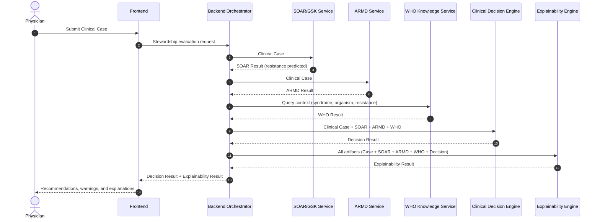
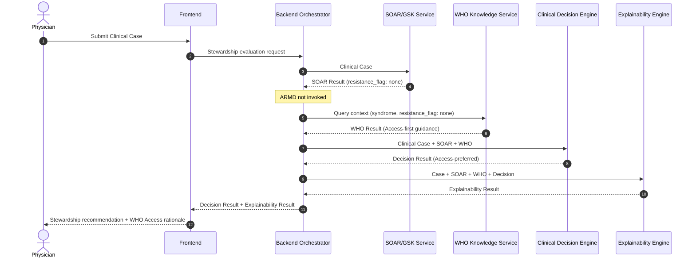
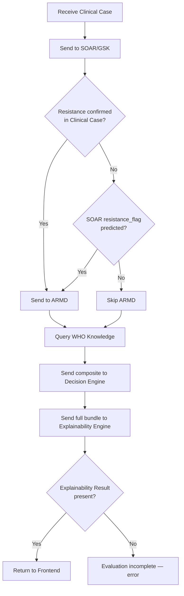
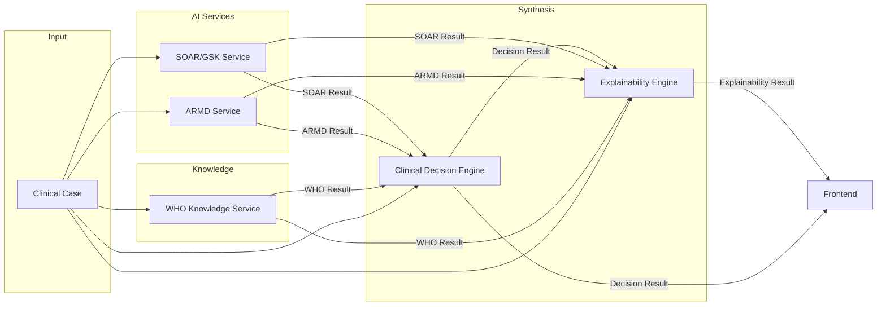

# PharmaTrybe — System Message Flow

**Phase 2, Step 3A — Architecture specification only**

This document describes the execution sequence for a stewardship evaluation. The FastAPI backend orchestrates every step. Services never communicate directly with each other.

**Governing document:** `PROJECT_CONTEXT.md`

---

## High-Level Flow

```
Physician submits Clinical Case
        ↓
   Backend Orchestrator
        ↓
   SOAR/GSK prediction
        ↓
 [if resistance predicted or confirmed]
   ARMD prediction
        ↓
   WHO knowledge lookup
        ↓
   Clinical Decision Engine
        ↓
   Explainability Engine
        ↓
   Frontend (recommendations + explanations)
```

---

## Orchestration Rules

The backend applies these rules when routing messages:

| Condition | Action |
|-----------|--------|
| Always | Send Clinical Case to SOAR/GSK |
| `resistance_status` is `confirmed` | Send Clinical Case to ARMD |
| SOAR `resistance_flag` is `predicted` | Send Clinical Case to ARMD |
| SOAR `resistance_flag` is `none` AND no confirmed resistance | **Skip ARMD** |
| Always | Query WHO Knowledge Service |
| Always | Send composite payload to Decision Engine |
| Always | Send full artifact bundle to Explainability Engine |
| Explainability Result missing | Evaluation is **incomplete** — do not return to frontend |

---

## Scenario 1 — Known or Predicted Resistance

When resistance is confirmed in the Clinical Case or predicted by SOAR, the full pipeline executes including ARMD.

### Message sequence

```
1. Physician → Backend:        Clinical Case
2. Backend → SOAR:             Clinical Case
3. SOAR → Backend:             SOAR Result (resistance_flag: predicted)
4. Backend → ARMD:             Clinical Case
5. ARMD → Backend:             ARMD Result
6. Backend → WHO:              Query (syndrome, organism, resistance_flag)
7. WHO → Backend:              WHO Result
8. Backend → Decision Engine:  Clinical Case + SOAR + ARMD + WHO
9. Decision Engine → Backend:  Decision Result (alternatives ranked)
10. Backend → Explainability:  Clinical Case + SOAR + ARMD + WHO + Decision
11. Explainability → Backend:  Explainability Result
12. Backend → Frontend:        Decision Result + Explainability Result
```

### Sequence diagram



### Clinical outcome

The Decision Engine surfaces **alternative evidence-supported antibiotics** when standard Access agents are deprioritized due to predicted or confirmed resistance.

---

## Scenario 2 — No Predicted Resistance

When SOAR returns `resistance_flag: none` and the Clinical Case has no confirmed resistance, ARMD is skipped. WHO Access antibiotics are preferred.

### Message sequence

```
1. Physician → Backend:        Clinical Case
2. Backend → SOAR:             Clinical Case
3. SOAR → Backend:             SOAR Result (resistance_flag: none)
4. [ARMD skipped]
5. Backend → WHO:              Query (syndrome, organism, resistance_flag: none)
6. WHO → Backend:              WHO Result (Access-first guidance)
7. Backend → Decision Engine:  Clinical Case + SOAR + WHO (no ARMD)
8. Decision Engine → Backend:  Decision Result (Access-preferred)
9. Backend → Explainability:  Clinical Case + SOAR + WHO + Decision (no ARMD)
10. Explainability → Backend:  Explainability Result
11. Backend → Frontend:        Decision Result + Explainability Result
```

### Sequence diagram



### Clinical outcome

The Decision Engine produces a **stewardship-first recommendation** prioritizing WHO Access antibiotics.

---

## Orchestration Decision Logic

The backend determines whether to invoke ARMD after receiving the SOAR Result.



---

## Data Flow Diagram

Shows which payloads pass between components.



---

## Parallelization Notes

The backend may optimize latency in Phase 3 implementation:

| Step | Parallelizable with | Notes |
|------|---------------------|-------|
| SOAR prediction | — | Must complete first (determines ARMD gate) |
| ARMD prediction | WHO lookup | After SOAR, if ARMD is required |
| WHO lookup | ARMD prediction | WHO query does not depend on ARMD output |
| Decision Engine | — | Requires all upstream results |
| Explainability Engine | — | Requires Decision Result |

In Scenario 2, WHO lookup may begin as soon as SOAR returns (no need to wait for a skipped ARMD step).

---

## Audit and Traceability

Every message in the flow carries a shared `request_id`. The backend assembles a **service trace** for each evaluation:

```json
{
  "request_id": "550e8400-e29b-41d4-a716-446655440000",
  "service_trace": {
    "soar": {
      "model_version": "2.1.0",
      "latency_ms": 120
    },
    "armd": {
      "model_version": "0.4.0-wp2",
      "latency_ms": 95,
      "skipped": false
    },
    "who": {
      "knowledge_version": "who-aware-2026.1",
      "latency_ms": 40
    },
    "decision": {
      "ruleset_version": "1.0.0",
      "latency_ms": 55
    },
    "explainability": {
      "template_version": "1.0.0",
      "latency_ms": 80
    }
  }
}
```

In Scenario 2, `armd.skipped` is `true`.

This trace supports reproducibility, clinical audit, and research use without exposing internal service implementations.

---

## Error Handling Principles

Architecture-level rules for Phase 3 implementation:

| Failure | Behavior |
|---------|----------|
| SOAR unavailable | Evaluation cannot proceed — return error to frontend |
| ARMD unavailable (Scenario 1) | Evaluation cannot proceed — resistance path requires ARMD |
| WHO unavailable | Evaluation cannot proceed — evidence base missing |
| Decision Engine unavailable | Evaluation cannot proceed — no recommendations |
| Explainability unavailable | Evaluation is **incomplete** — do not present recommendations without explanation |
| Partial SOAR/ARMD confidence | Decision Engine proceeds with warnings; Explainability surfaces low-confidence flags |

Patient safety takes priority over predictive performance. When in doubt, the system should fail closed rather than return an under-explained recommendation.

---

## Related Documents

- [service-contracts.md](./service-contracts.md) — Service purpose, responsibilities, and boundaries
- [request-response-schemas.md](./request-response-schemas.md) — Payload definitions and JSON examples
