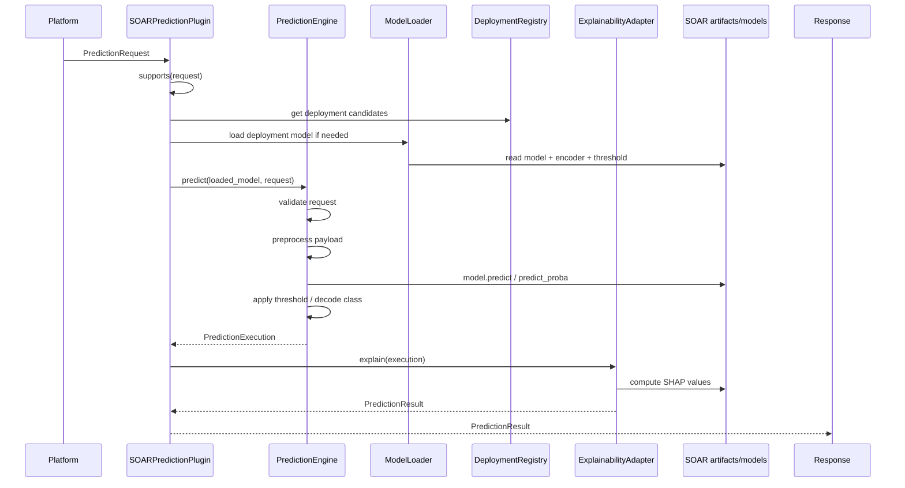
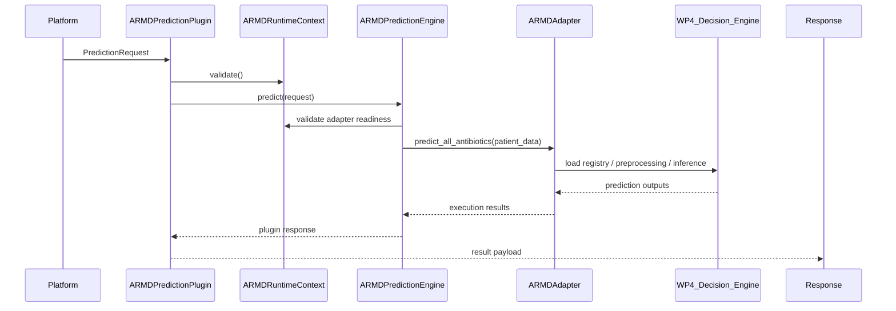

# Prediction Call Path Verification

## Objective

Verify the call path for each prediction plugin is identical before and after inheritance refactoring.

## SOAR Call Path

### SOAR verification outcome

- request validation still occurs in the plugin and engine
- deployment loading still occurs via registry and model loader
- inference still flows through the same engine method
- explanation still flows through the same SHAP adapter method
- final response remains `PredictionResult`

## ARMD Call Path

### ARMD verification outcome

- runtime readiness gate remains enforced
- adapter call sequence remains the same
- inference still occurs through the WP4-backed adapter path
- response mapping remains consistent with the engine output contract

## Final Call-Path Verdict

The call paths for both plugins remain functionally identical to their pre-inheritance structure. The inheritance refactor has not changed the sequence of operations that produces prediction output.
