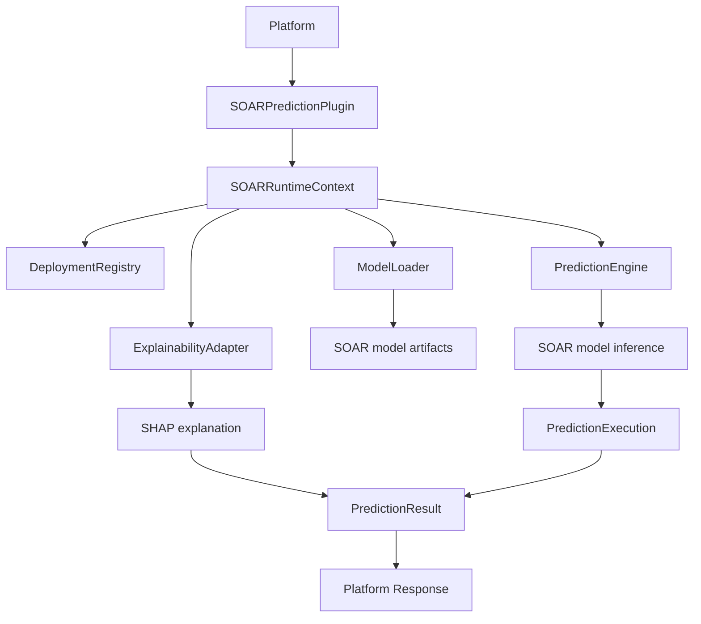
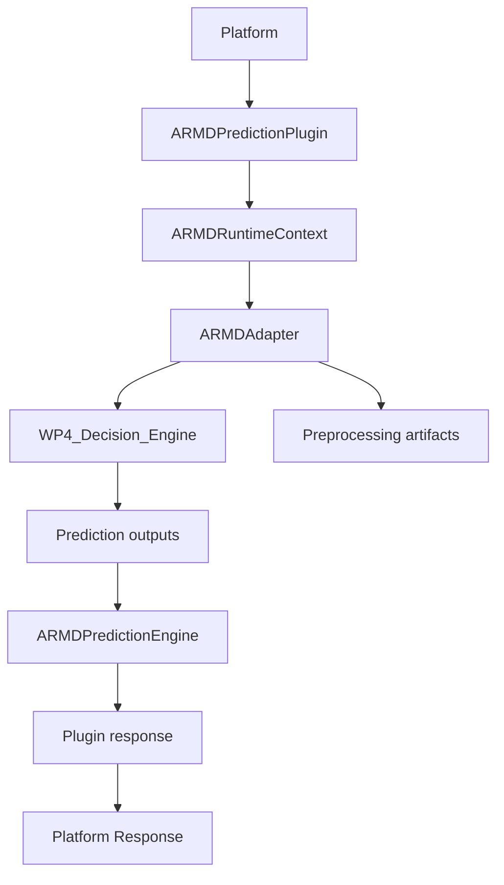

# Runtime Call Graph

## Objective

Capture the runtime dependency graph used by both prediction plugins and confirm that the lifecycle contract remains unchanged.

## SOAR runtime graph

## ARMD runtime graph

## Lifecycle check

### SOAR lifecycle

Platform -> Plugin.initialize -> runtime_context.initialize -> registry initialize -> model-ready state -> plugin.validate -> prediction -> shutdown

### ARMD lifecycle

Platform -> Plugin.initialize -> runtime_context.initialize -> adapter.initialize -> registry/artifacts readiness -> plugin.validate -> prediction -> shutdown

## Runtime integrity conclusion

The parent class refactor changes class inheritance only; the actual runtime dependency graph remains functionally identical and therefore preserves behaviour.

## Final Runtime Certification

Behaviour preserved.
